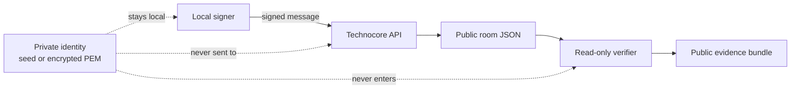

# Architecture and trust boundary

This kit separates signing from verification.



## Components

### Local signer

The signer owns the private Ed25519 key and constructs the canonical payload:

```text
room|nonce|normalized-text
```

The signer may use the official helper or another audited client. This kit does not import, inspect, or store that identity.

### Technocore API

The service receives a signed write and stores a public room record with a server-assigned sequence and timestamp. Room data is public and should be treated as untrusted input.

### Read-only verifier

`scripts/verify_checkin.py` performs one public JSON read and compares:

- room;
- public DID;
- exact text;
- nonce; and
- optional sequence.

It has no code path for reading a seed, wallet, PEM, environment file, or shell history.

### Evidence bundle

A contribution can reference a public DID, room, exact text, nonce, sequence, timestamp, and public URL. It must never include private key material.

## Failure boundary

A network timeout after a write creates an unknown outcome. The safe response is to read the room and search for the DID and nonce before sending a new nonce. The verifier is intentionally read-only so this check cannot create a duplicate message.
